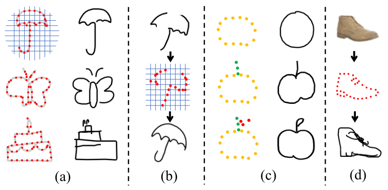

SketchLattice: Latticed Representation for Sketch Manipulation
========================================================

SketchLattice @ICCV21

This is the official implementation (PyTorch) of SketchLattice: Latticed Representation for Sketch Manipulation https://arxiv.org/abs/2108.11636

</img>

## Datasets and Preprocessing

### Datasets
  
There are 10 categories randomly selected from the <a href="https://github.com/googlecreativelab/quickdraw-dataset#sketch-rnn-quickdraw-dataset" target="_blank">QuickDraw Dataset<a> for all experiments. You can dowanload the data (one `.npz` file per class) from <a href="https://drive.google.com/file/d/1spj0eHU8HPtp1ET-3FVjWsja2G8F8CSF/view?usp=sharing" target="_blank">Google Cloud<a>.

After downloading, please unzip and place all the npz files into the `./dataset` directory.

### Sketch to Graph and Adj

To get started, a preprocess step needs to be done firstly by using the script `sketch2GraphAndAdjScript.py`. You can simply run the following command.
  ```python
    python -u sketch2GraphAndAdjScript.py
  ```
  
* Before running the script, you should edit the following haperparameters:
  * `outPath`: 
  * `split_nums`: 
  * `node_nums`:
  * `mode(train/test)`:
  
* After running the script, you will get `*_adjs_train(test).npz` and `*_nodes_train(test).npz` for training(testing) in the output directory.

## Training and Testing
  
### Setup
  
Setup environment via requirements.txt

```bash
  pip install -r requirements.txt
```
  
### Train

1. edit `generation_hyper_params.py`, setting `self.data_location`, `self.save_path`,`self.category` and other parameters if you need.

2. For training, run
  ```python
    python -u generation_sketch_gcn.py
  ``` 

### Test (Reconstruct Sketches)

The pre-trained models(encoder & decoder) and the corresponding parameters are available in `./models_32_150`.
  
1. edit `generation_hyper_params.py`, setting `self.data_location`, `self.save_path`,`self.category` and other parameters if you need.
  
2. For validating, run
  ```python
    python -u generation_inference.py
  ``` 
  
## Bibtex: 
If you have some inspirations for your work, we would appreciate your quoting our paper.

    @inproceedings{yonggang2021sketchlattice,
        title={SketchLattice: Latticed Representation for Sketch Manipulation},
        author={Yonggang Qi, Guoyao Su, Pinaki Nath Chowdhury, Mingkang Li, Yi-Zhe Song},
        booktitle={ICCV},
        year={2021}
    }
